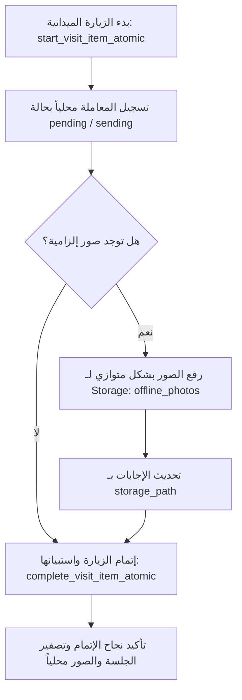

# خطة التدقيق الشامل وإعادة تصميم تدفق الزيارات End-to-End
**المرحلة: ط-2ب-2 (تحليل وتصميم وتخطيط حصري)**

## 1. حالة الوثيقة
«مسودة تحليلية قيد المراجعة — غير معتمدة للتنفيذ أو لتطبيق قاعدة البيانات».

---

## 2. مصادر الحقيقة (Sources of Truth)
تمت قراءة وفحص الملفات التالية بشكل كامل وكتابة هذا التقرير بناءً على محتواها الفعلي:

| تصنيف الملف | رابط الملف | الدور والمسؤولية في الموديول |
|---|---|---|
| **شاشات الزيارات** | [VisitPlansPage.tsx](file:///d:/projects/new-edara-sys/src/pages/activities/VisitPlansPage.tsx) | شاشة عرض وإدارة قائمة خطط الزيارات بالفلترة والتأكيد والإلغاء. |
| | [VisitPlanForm.tsx](file:///d:/projects/new-edara-sys/src/pages/activities/VisitPlanForm.tsx) | شاشة معالج إنشاء خطة زيارات بـ 4 خطوات (Settings, Customers, Ordering, Review). |
| | [VisitPlanDetail.tsx](file:///d:/projects/new-edara-sys/src/pages/activities/VisitPlanDetail.tsx) | شاشة تفاصيل الخطة وإدارة بنودها (إضافة، تعديل، حذف، إعادة ترتيب، تخطي، جدولة). |
| | [VisitExecutionMode.tsx](file:///d:/projects/new-edara-sys/src/pages/activities/VisitExecutionMode.tsx) | وضع التنفيذ الميداني للزيارات واستبقاء الجلسة المحلية والاستبيانات. |
| | [ActivityForm.tsx](file:///d:/projects/new-edara-sys/src/pages/activities/ActivityForm.tsx) | نموذج تسجيل الأنشطة اليدوي المستقل (يحتوي على حاجز لمنع تنفيذ زيارات الخطة يدوياً). |
| | [ActivityDetail.tsx](file:///d:/projects/new-edara-sys/src/pages/activities/ActivityDetail.tsx) | شاشة عرض تفاصيل النشاط والروابط وعناصر الاستبيان والتحصيل والبيع. |
| **الخطافات والخدمات** | [useVisitExecutionSession.ts](file:///d:/projects/new-edara-sys/src/hooks/useVisitExecutionSession.ts) | إدارة جلسة العمل الميداني وإرسال العمليات الذرية وإلغاء القفل محلياً. |
| | [useQueryHooks.ts](file:///d:/projects/new-edara-sys/src/hooks/useQueryHooks.ts) | خطافات الاستعلام والـ Mutations للاتصال بـ Supabase و React Query. |
| | [activities.ts (services)](file:///d:/projects/new-edara-sys/src/lib/services/activities.ts) | خدمات الـ RPC والمزامنة مع Supabase والتحقق الجغرافي. |
| **تعريفات الأنواع** | [activities.ts (types)](file:///d:/projects/new-edara-sys/src/lib/types/activities.ts) | النماذج البنيوية وعقود دخل العمليات الذرية والاستبيانات. |
| **قواعد البيانات المحلية** | [visitsDb.ts](file:///d:/projects/new-edara-sys/src/lib/db/visitsDb.ts) | تخطيط جداول IndexedDB للجلسات والعمليات المعلقة والتحقق من سلامتها. |
| **التحقق من البيانات** | [visitPlanFormValidation.ts](file:///d:/projects/new-edara-sys/src/pages/activities/visitPlanFormValidation.ts) | عقود التحقق من توافق ترتيب وأوقات البنود في خطة الزيارة. |
| **الصلاحيات والميزات** | [constants.ts](file:///d:/projects/new-edara-sys/src/lib/permissions/constants.ts) | المرجع لرموز الصلاحيات الموزعة على الأدوار في النظام. |
| | [features.ts](file:///d:/projects/new-edara-sys/src/lib/config/features.ts) | مفاتيح التحكم بالـ Feature Flags والمسار المعتمد الفعال (Atomic vs Legacy). |
| **الـ SQL Migrations** | `20260703134100_visits_foundation_schema.sql` | البنية التحتية للجداول والـ Constraints الأساسية لموديول الزيارات. |
| | `20260704103808_visits_rls_state_machine.sql` | سياسات أمن البيانات RLS والتحقق من الصلاحيات والمناصب. |
| | `20260704145447_visits_plan_atomic_rpcs.sql` | الـ RPCs الذرية لإدارة الخطط (إنشاء، تأكيد، إلغاء، إعادة الترتيب). |
| | `20260705103803_visits_field_execution_atomic_rpcs.sql` | الـ RPCs الذرية للتنفيذ الميداني (البدء، التخطي، الإنهاء، مبرر الموقع). |
| | `20260708114440_visits_plan_detail_gap_rpcs.sql` | الـ RPCs الذرية لسد فجوات الإغلاق اليومي للزيارات الفائتة وإعادة الجدولة. |

---

## 3. خريطة تدفق فعلية (End-to-End Flow Map)
يصف الجدول أدناه تفاصيل مسارات العمل الفعلية لكل عملية في موديول الزيارات:

| اسم العملية | الشاشة المستدعاة | الـ Handler | الخدمة والـ hook | اسم الـ RPC الفعلي | صلاحيات الواجهة الحالية | صلاحية الـ RPC الفعلية | نوع العملية | مسار التنفيذ | السلوك دون اتصال (Offline) | الـ operationId | سلوك الفشل (Failure) |
|---|---|---|---|---|---|---|---|---|---|---|---|
| **بدء الزيارة** | `VisitExecutionMode` | `handleStartVisit` | `startVisit` من `useVisitExecutionSession` | `start_visit_item_atomic` | `visit_plans.create` *(مخالفة)* | `visit_plans.update_own` AND `activities.create` | ذرية (Atomic) | طابور IndexedDB | تحفظ محلياً كـ `retryable` وتعمل الجلسة بـ `tempSession`. | يُولد UUID محلياً ويخزن في الطلب. | تتحول لحالة `retryable` عند انقطاع الشبكة، أو `failed` عند رفض المنطق. يتم اختبار row-level locks وسيناريو SELECT ... FOR UPDATE ومنع التكرار الفعلي. |
| **إنهاء الزيارة** | `VisitExecutionMode` | `handleCompleteVisit` | `completeVisit` من `useVisitExecutionSession` | `complete_visit_item_atomic` | `visit_plans.create` *(مخالفة)* | `visit_plans.update_own` AND `activities.create` | ذرية (Atomic) | طابور IndexedDB | تحفظ كـ `retryable` في الطابور. **التوقيت الفعلي لحذف الجلسة**: لا تحذف الجلسة من IndexedDB إلا بعد نجاح الإرسال الفعلي ورجوع `ok=true` من السيرفر. | يُولد UUID محلياً ويرسل كجزء من المعاملة. | تبقى كـ `retryable` في حال فشل الشبكة، وتتحول لـ `conflict` عند تضارب حالات الخادم. يُرفض حفظ المسودة أو إكمال الزيارة ويُعاد خطأ آمن للمستخدم. |
| **تخطي البند (الميداني)** | `VisitExecutionMode` | `handleSkip` | `skipVisit` من `useVisitExecutionSession` | `skip_visit_item_atomic` | لا يوجد (يتحقق من `!isActive` فقط) | `visit_plans.update_own` OR `visit_plans.update` | ذرية (Atomic) | طابور IndexedDB | تحفظ كـ `retryable` وتلغى الجلسة المحلية بعد إتمام الـ RPC بنجاح. | يُولد UUID محلياً. | تبقى في الطابور للمحاولة مجدداً أو تفشل عند التعارض. |
| **تخطي البند (الإداري)** | `VisitPlanDetail` | `handleSkip` | `skipVisitAtomic` من `activities` | `skip_visit_item_atomic` | لا يوجد (يتحقق من حالة الخطة فقط) | `visit_plans.update_own` OR `visit_plans.update` | ذرية (Atomic) | اتصال RPC مباشر | تفشل مباشرة (تحتاج شبكة فوراً). | يُولد UUID محلياً في ريف `skipOperationRef`. | تفشل على الواجهة مع إبقاء البند معلقاً. |
| **إعادة الجدولة** | `VisitPlanDetail` | `handleReschedule` | `rescheduleAtomic` من `activities` | `reschedule_visit_item_to_date_atomic` | لا يوجد (يتحقق من حالة الخطة فقط) | `visit_plans.update_own` OR `visit_plans.update` | ذرية (Atomic) | **اتصال RPC مباشر (ليست في طابور المزامنة)** | تفشل مباشرة لعدم اتصال الشبكة. | يُولد UUID محلياً في ريف `rescheduleOperationRef`. | تفشل العملية وتطلب إعادة المحاولة. |
| **إنهاء اليومية** | `VisitPlanDetail` | `handleBulkClose` | `closeMissedAtomic` من `activities` | `close_visit_day_missed_atomic` | `visit_plans.confirm` *(مخالفة)* | `visit_plans.close_administrative` OR `visit_plans.close_day` | ذرية (Atomic) | **اتصال RPC مباشر (ليست في طابور المزامنة)** | تفشل مباشرة لعدم اتصال الشبكة. | يُولد UUID محلياً في ريف `bulkCloseOperationRef`. | تظل البنود معلقة وتعرض رسالة خطأ. |
| **إعادة الترتيب** | `VisitPlanDetail` | `handleReorder` (Drag/Arrows) | `reorderMutAtomic` من `activities` | `reorder_visit_plan_items_atomic` | `visit_plans.update` OR `visit_plans.update_own` | `visit_plans.update` OR `visit_plans.update_own` | ذرية (Atomic) | اتصال RPC مباشر | تفشل وتتراجع الواجهة عن الترتيب فوراً. **لا ترتيب محلي مؤقت**. | يُولد UUID محلياً في ريف `reorderOperationRef`. | تلغى الحركة المعلقة ويعود الترتيب القديم بالكاش. |

---

## 4. جرد شامل لكل عمليات الكتابة (Data Mutation Audit)
توثيق لكافة سلوكيات التعديل والإدخال في النظام:

| الإجراء / الزر | المكون المصدر | نوع العملية | مسار التنفيذ | صلاحية الواجهة الحالية | صلاحية الـ RPC الفعلية | قفل النقر المزدوج | ثبات المعرف (Idempotency Key) | تفاصيل القيود البرمجية وسلوك الفشل |
|---|---|---|---|---|---|---|---|---|
| **إنشاء خطة (Draft)** | `VisitPlanForm` | ذرية (Atomic) | Direct RPC | `visit_plans.create` | `visit_plans.create` | نعم (`saving` blocker) | `createOperationRef` (UUID) | تفشل إذا كانت الخطة مكررة لليوم للموظف. |
| **تأكيد واعتماد** | `VisitPlanDetail` | ذرية (Atomic) | Direct RPC | `visit_plans.confirm` | `visit_plans.confirm` | نعم (`processing` mutex) | `confirmOperationIdRef` (UUID) | تغير حالة الخطة إلى `confirmed` وتمنع التعديل اللاحق للبنود. |
| **إلغاء الخطة (القائمة)** | `VisitPlansPage` | ذرية (Atomic) | Direct RPC | `visit_plans.cancel` | `visit_plans.cancel` | نعم (`processing` mutex) | `cancelOperationRef` (UUID) | تتطلب إدخال سبب الإلغاء بشكل إجباري. |
| **إلغاء الخطة (التفاصيل)**| `VisitPlanDetail` | ذرية (Atomic) | Direct RPC | `visit_plans.cancel` | `visit_plans.cancel` | نعم (`processing` mutex) | `cancelOperationRef` (UUID) | تتطلب إدخال سبب الإلغاء وجوباً وتلغي الخطة بالكامل. |
| **إضافة بند** | `VisitPlanDetail` | تقليدية (Legacy) | Direct Table Insert | `visit_plans.create` | سياسة RLS لجدول `visit_plan_items` | نعم (`addingItem` blocker) | لا يوجد (إدخال مباشر) | مسموح فقط على الخطط في حالة `draft` ولا تؤثر على البنود المنفذة. |
| **حذف بند** | `VisitPlanDetail` | تقليدية (Legacy) | Direct Table Delete | `visit_plans.create` | سياسة RLS لجدول `visit_plan_items` | نعم (`deletingItem` blocker) | لا يوجد (حذف مباشر) | مسموح فقط للخطط غير المؤكدة. |
| **إعادة الترتيب** | `VisitPlanDetail` | ذرية (Atomic) | Direct RPC | `visit_plans.update` / `update_own` | `visit_plans.update` / `update_own` | نعم (`isMutatingReorderRef` lock) | `reorderOperationRef` (UUID) | تفشل وتتراجع إذا كان هناك بند من بنود الخطة ليس في حالة `pending`. |
| **تخطي (التفاصيل)** | `VisitPlanDetail` | ذرية (Atomic) | Direct RPC | لا يوجد (حالة الخطة فقط) | `visit_plans.update` / `update_own` | نعم (`isMutatingSkipRef` lock) | `skipOperationRef` (UUID) | تفشل وتظهر تنبيهاً إذا تغيرت حالة البند في هذه الأثناء. |
| **تخطي (الميداني)** | `VisitExecutionMode` | ذرية (Atomic) | IndexedDB Queue | لا يوجد (حالة البند فقط) | `visit_plans.update_own` OR `visit_plans.update` | نعم (`isExecutingRef` lock) | `operationId` للعملية الذرية في طابور IndexedDB | يتم حفظ سبب التخطي وتخضع لمزامنة الطابور عند توفر الشبكة. |
| **إعادة الجدولة** | `VisitPlanDetail` | ذرية (Atomic) | Direct RPC | لا يوجد (حالة الخطة فقط) | `visit_plans.update_own` OR `visit_plans.update` | نعم (`isMutatingRescheduleRef` lock) | `rescheduleOperationRef` (UUID) | تبحث عن خطة لليوم المستهدف أو تنشئها مسودة وتنسخ البند إليها. |
| **إنهاء اليومية** | `VisitPlanDetail` | ذرية (Atomic) | Direct RPC | `visit_plans.confirm` *(مخالفة)* | `visit_plans.close_administrative` OR `visit_plans.close_day` | نعم (`isMutatingBulkCloseRef` lock) | `bulkCloseOperationRef` (UUID) | تحول البنود المعلقة إلى `missed` وتغلق الخطة إدارياً. |
| **طلب استثناء GPS** | `VisitExecutionMode` | ذرية (Atomic) | IndexedDB Session | لا يوجد (حالة الموقع الجغرافي) | `visit_plans.update_own` AND `activities.create` | نعم (`completing` blocker) | جزء من طلب الإنهاء | يكتب مبرر الخروج عن نطاق موقع العميل في الجلسة المحلية. |
| **بدء الزيارة** | `VisitExecutionMode` | ذرية (Atomic) | IndexedDB Queue | `visit_plans.create` *(مخالفة)* | `visit_plans.update_own` AND `activities.create` | نعم (`isExecutingRef` lock) | `operationId` للعملية الذرية في طابور IndexedDB | تحدث حالة البند محلياً وتدرج لبدء تنفيذ المعاملة اللوجستية. |
| **إنهاء الزيارة** | `VisitExecutionMode` | ذرية (Atomic) | IndexedDB Queue | `visit_plans.create` *(مخالفة)* | `visit_plans.update_own` AND `activities.create` | نعم (`isExecutingRef` lock) | `operationId` للعملية الذرية في طابور IndexedDB | تجمع الاستبيانات والموقع الجغرافي وترسل كمعاملة ذرية واحدة. |
| **مسودة استبيان** | `VisitExecutionMode` | محلي (Offline) | IndexedDB Session | لا يوجد | لا يوجد (تخزين محلي) | لا يوجد | لا يوجد | تكتب محلياً بالكامل في جدول `visitSessions` لتفادي فقدان المدخلات. |
| **رفع الصور** | `ProofUploadButton` | مباشر للـ Bucket | API / Storage | لا يوجد | سياسة أمن Supabase Storage | نعم (حظر الاختيار أثناء الرفع) | لا يوجد | ترفع الملف مباشرة وتحدث مسار التخزين محلياً. |
| **إنشاء نشاط مرتبط** | `ActivityForm` | ممنوع تماماً | حظر وتوجيه | لا يوجد | لا يوجد | لا يوجد | لا يوجد | **مغلق برمجياً**: تمنع الشاشة إدخال أنشطة يدوية لبنود الزيارات. |
| **التحديث المباشر** | مباشر من العميل | ممنوع تماماً | RLS / DDL | لا يوجد | RLS (غير مسموح) | لا يوجد | لا يوجد | **مغلق أمنياً**: القيود تمنع تعديل حقول التنفيذ والـ GPS. |

---

## 5. فجوات التصميم والصلاحيات (Verified Gaps & Inconsistencies)

### أ. فجوات قصوى مثبتة في كود المشروع (Verified P0 Gaps):
1. **تعارض نوع البيانات للصور في الاستبيان (Base64 vs StoragePath)**:
   - *الخلل البرمجي*: يعتمد المكون `ChecklistForm.tsx` عند التقاط صورة على `FileReader.readAsDataURL(file)` الذي يولد سلسلة Base64 Data URL ويخزنها في `answer_value`.
   - *الرفض القاطع*: يستدعي خطاف الجلسة `useVisitExecutionSession.ts` دالة التحقق `mapChecklistResponses` والتي تلقي استثناءً صريحاً وتوقف العملية إذا بدأت القيمة بـ `data:` أو احتوت على `;base64,` معلنة: `"لا يمكن حفظ أو إرسال صور ترميز Base64/Data URL مباشرة"`.
   - *الأثر*: يُرفض حفظ المسودة أو إكمال الزيارة ويُعاد خطأ آمن للمستخدم عند محاولة إرفاق صور الاستبيانات الإجبارية.
2. **غياب التبعية والترتيب في طابور العمليات (Execution Queue Race Condition)**:
   - *الخلل البرمجي*: عند البدء والإنهاء في وضع عدم الاتصال، تكتب العمليتان (`start` ثم `complete`) في جدول `pendingVisitOperations`.
   - *الأثر*: عند عودة الاتصال ومحاولة المزامنة، لا توجد تبعية برمجية تجبر النظام على إرسال وعلاج عملية `start` أولاً وانتظار نجاحها على الخادم قبل إرسال عملية `complete`.
   - *النتيجة*: إذا أُرسلت عملية الإنهاء (`complete`) أولاً أو بشكل متزامن، سيرفضها السيرفر فوراً لإخلال قيد الحالة (حلقات السيرفر تتطلب حالة `in_progress` للإنهاء بينما هي لا تزال `pending` في السيرفر)، وتتحول العملية لتعارض دائم `SYNC_CONFLICT` غير قابل للحل تلقائياً.
3. **تحديث حقول خطط الزيارات بالواجهة بشكل تقليدي**:
   - لا تزال عمليات إضافة البنود وحذف البنود الفردية في شاشة `VisitPlanDetail.tsx` تعتمد على التعديل المباشر للجداول (`addPlanItem` و `deletePlanItem`) بدلاً من RPCs ذرية لحفظ سلامة الخطة الإجمالية.

### ب. فجوات الصلاحيات غير المتوافقة برمجياً (P1 Permission Gaps):
1. **صلاحية إنهاء اليومية**:
   - *الواجهة*: تفحص صلاحية `visit_plans.confirm` لعرض وإتاحة زر "إنهاء اليومية المتبقية" لتبديل البنود لـ `missed`.
   - *قاعدة البيانات*: يتحقق الـ RPC الفعلي `close_visit_day_missed_atomic` من صلاحية `visit_plans.close_administrative` أو `visit_plans.close_day`.
   - *الأثر*: يفشل الاستدعاء للمشرفين الذين يملكون صلاحية الاعتماد فقط دون صلاحيات الإغلاق الإداري.
2. **صلاحية بدء وتنفيذ الزيارة**:
   - *الواجهة*: تفحص صلاحية `visit_plans.create` لتحديد ما إن كان بإمكان المستخدم بدء وتنفيذ الزيارات الميدانية.
   - *قاعدة البيانات*: تتحقق الـ RPCs الخاصة بالبدء والإنهاء من اجتماع صلاحيتي `visit_plans.update_own` و `activities.create`.
3. **نقص التعريفات**:
   - الصلاحيات الإدارية الحرجة للتحكم بالزيارات (`visit_plans.close_administrative`, `visit_plans.close_day`, `visit_plans.review_gps`) غير معرفة بالكامل في قائمة الصلاحيات بملف `constants.ts` مما يمنع فحصها بشكل صحيح في حراس المسارات والأدوار بالواجهة.

### ج. ضوابط التحكم بميزة التنفيذ الذري (Atomic Execution Feature Flag Rules):
- **قبل تطبيق الـ Migrations**: تظل الميزة غير مفعلة (`VISITS_ATOMIC_EXECUTION = false`).
- **بعد التطبيق اليدوي للـ Migrations على قاعدة اختبار**: تُفعل الميزة (`VISITS_ATOMIC_EXECUTION = true`) في بيئة الاختبار فقط للتحقق والتدقيق.
- **بعد نجاح RLS/RPC/E2E**: يتخذ قرار مستقل لتفعيل بيئة الإنتاج بناءً على موافقة وإذن المستخدم الصريح والمباشر.
- **سياسة الـ Fallback**: يمنع استخدام مسار الـ Legacy fallback بعد تطبيق سياسات RLS الجديدة على السيرفر إلا إذا أثبتت اختبارات PostgreSQL الحية بقاء التوافق التام.

### د. فرضيات تتطلب بيئة اختبار حية لقاعدة البيانات (PG Test Hypotheses):
1. **تجاوز سياسة RLS بموجب SECURITY DEFINER**:
   - *الفرضية*: إن الدوال الخاصة المكتوبة بـ `SECURITY DEFINER` تتجاوز قيود الـ RLS المفروضة على جداول `activities` و `visit_checklist_responses` عند الإدراج الذري نيابة عن المندوبين.
   - *التحقق المطلوب*: يجب فحص بيئة اختبارية للتأكد من عدم وجود خيار `FORCE ROW LEVEL SECURITY` مفعل على الجداول للـ owner، والتأكد من ملاءمة الـ search path المفروض لـ `pg_catalog` لضمان عدم تسريب صلاحيات التنفيذ والتنفيذ الفعلي بعد التطبيق على قاعدة اختبار.
2. **شروط RLS غير المتوقعة للأنشطة المرتبطة**:
   - *الفرضية*: سياسة `acts_insert` تمنع إدخال أي سجل نشاط يحتوي على `visit_plan_item_id IS NOT NULL`.
   - *التحقق المطلوب*: التأكد عملياً من أن المحرك لا يقوم بتقييم سياسة RLS للـ authenticated user عند إدراج الصف عبر دالة الـ RPC الذرية لتجنب رفض المعاملة بشكل غير مباشر.

### هـ. تحسينات تجربة المستخدم الميدانية (P2 UX Enhancements):
1. تحويل النوافذ المنبثقة للتخطي وإعادة الجدولة والإغلاق إلى Bottom Sheets منزلقة وسلسة على الهواتف.
2. معالجة تداخل شريط الإجراءات السفلي المثبت لـ `VisitExecutionMode` مع شريط التنقل للـ PWA على الشاشات الصغيرة.

---

## 6. تصميم الصور دون اتصال (Offline Blob Storage Design)
لتفادي مشكلة تعارض الـ Base64 وضمان سلامة ذاكرة المتصفح وسرعة الأداء، يتم تطبيق نمط الحفظ الثنائي للملفات (Blobs):

### أ. الهيكل البنيوي لجدول الصور محلياً (`offline_photos` في IndexedDB):
```typescript
interface OfflinePhoto {
  localBlobId: string;       // معرف فريد UUID يولد محلياً عند الالتقاط
  userId: string;            // لضمان عزل البيانات بين الحسابات على نفس الجهاز
  planId: string;            // معرف خطة الزيارات
  itemId: string;            // معرف بند الزيارة المحدد
  questionId: string;        // معرف سؤال الاستبيان المرتبط بالصورة
  blob: Blob;                // الملف الثنائي الفعلي للصورة (Binary Blob)
  mimeType: string;          // نوع الملف (image/jpeg)
  sizeBytes: number;         // حجم الملف بالبايت
  checksum: string;          // بصمة رقمية SHA-256 للملف لضمان سلامته قبل الرفع
  uploadState: 'pending' | 'uploading' | 'uploaded' | 'failed';
  attempts: number;          // عدد محاولات الرفع لجدول المزامنة
}
```

### ب. قواعد وضوابط الحفظ والرفع:
1. **عزل الحسابات (Account Isolation)**: يمنع الاستعلام أو الوصول لأي ملف صورة لا يطابق الـ `userId` للمستخدم الفعلي النشط.
2. **حدود السعة والحصص (Quota Limit)**:
   - الحد الأقصى لحجم الصورة الفردية: `2MB`.
   - الحد الأقصى لإجمالي سعة تخزين الصور محلياً للمستخدم: `50MB`. في حال تجاوزها يتم منع الالتقاط وطلب رفع الصور العالقة أولاً.
3. **سياسة الضغط المحلي (Compression Policy)**:
   - يتم ضغط الصورة الملتقطة على الجهاز تلقائياً باستخدام Canvas API أو مكتبة خفيفة محلياً لتحويلها إلى صيغة `image/jpeg` بدقة لا تتجاوز `1200px` للعرض أو الارتفاع قبل حفظها كـ Blob.
4. **مسار التخزين الآمن والسلة الخاصة (Private Bucket Storage)**:
   - ترفع الصور إلى سلة خاصة ومغلقة بالـ RLS على Supabase تسمى `visit-proofs` تحت مسار منظم: `visit-proofs/plans/{planId}/items/{itemId}/{localBlobId}.jpg`.
   - لا يمكن الوصول للمسار إلا للموظف صاحب الخطة أو مشرفي فرعه.
5. **ربط الاستبيان بالمسار الآمن (storage_path)**:
   - يتم تعيين القيمة المرجعية في إجابة الاستبيان على حقل `answer_json` بالشكل التالي: `{ "storage_path": "visit-proofs/plans/.../uuid.jpg" }` مع ترك `answer_value` فارغاً (`null`).
6. **منع الإنهاء قبل المزامنة**:
   - يتم التحقق برمجياً قبل استدعاء `completeVisit` من خلو جدول `offline_photos` المحلي من أي صور معلقة أو فشل رفعها لسؤال استبيان إجباري.
7. **التنظيف التلقائي (Cleanup)**:
   - لا تحذف الصورة محلياً من IndexedDB إلا بعد التحقق الفعلي من اكتمال الرفع لسلة التخزين وتأكيد السيرفر لاستلام الملف.
8. **الاستعادة بعد التحديث (Recovery after reload)**:
   - عند تحميل الواجهة أو إعادة تشغيل التطبيق، يتم فحص جدول `offline_photos` محلياً واستئناف أي محاولات رفع معلقة غير مكتملة تلقائياً.

---

## 7. ترتيب وجدولة عمليات طابور Offline (Dependency Graph & Pipeline)

لمنع حدوث أخطاء تعارض الحالات ومزامنة الصور، يجب التحكم برمجياً في تسلسل إرسال العمليات الذرية:

### أ. مخطط التبعية البرمجي (Dependency Chain):



### ب. قواعد جدولة المزامنة والتحكم بالطفو:
1. **ربط التبعية الصريح (Explicit Dependency Key)**:
   - يضاف حقل `dependsOnOperationId` لجدول العمليات المعلقة IndexedDB.
   - لا يمكن إرسال عملية `complete_visit_item_atomic` إلا إذا تم التحقق من نجاح وحذف العملية المرجعية للبدء `start_visit_item_atomic` ذات الـ `operationId` المطابق.
   - عدم إرسال `complete` إذا كانت عملية الـ `start` غير مكتملة بنجاح على الخادم.
   - الطوابع الزمنية `createdAt` وحدها غير كافية لضمان التسلسل بسبب احتمالية تأخر المعالجة أو تزامن الاستدعاءات.
2. **قفل معالجة الإرسال (Processing Lease)**:
   - عند محاولة إرسال عملية للشبكة، يتم وسمها محلياً بـ `sending` مع تحديد سقف زمني للقفل (مثلاً: `lockedUntil = Date.now() + 30000` ثانية).
   - يمنع القفل محاولات الإرسال المتكررة لنفس العملية من نوافذ متصفح موازية.
3. **الاسترداد من العمليات العالقة (Stale Sending Recovery)**:
   - عند تشغيل التطبيق أو إعادة تحميل الصفحة، يتم تصفير حالة أي عملية عالقة في وضع `sending` تجاوزت سقف القفل وإعادتها لحالة `retryable` لاستئناف إرسالها.
4. **سياسة إعادة المحاولة اللوغاريتمية (Exponential Backoff)**:
   - في حال فشل الاتصال بالشبكة ورصد `CONNECTION_ERROR` يتم جدولة إعادة المحاولة بتأخير يتضاعف لوغاريتمياً (2s, 4s, 8s, 16s...) بحد أقصى `300` ثانية لمنع استنزاف بطارية وموارد الجهاز.
5. **التعامل مع التعارض الحاد (Terminal Conflict)**:
   - في حال رجوع كود خطأ حاد من السيرفر مثل `SYNC_CONFLICT` أو `DOMAIN_VALIDATION_FAILED` (مثل رفض مبرر GPS أو صلاحيات غير كافية)، يتم تعيين حالة العملية الفاشلة لـ `conflict` أو `failed` وإيقاف معالجة الطابور تلقائياً للبند المحدد دون حذف العملية لحماية مدخلات المندوب، وتنبيهه بضرورة التدخل اليدوي.
6. **منع حذف البيانات المحلية المبكر**:
   - لا تحذف الجلسة المحلية ولا تحذف الصور المرفقة والبيانات المحلية من المتصفح إلا بعد تأكيد الخادم الفعلي لاستلام ونجاح جميع العمليات التابعة وتعديل حالة البند في السيرفر لـ `completed`.

---

## 8. الصلاحيات الفعلية والمعرّفات في النظام (Database Authority Model)
يعتمد النظام على رموز صلاحيات صريحة ومحددة في قاعدة البيانات والسيرفر، وهي كالتالي:

1. `visit_plans.create`: صلاحية إنشاء مسودة خطة زيارات جديدة (المندوب والمشرف).
2. `visit_plans.read_own`: صلاحية المندوب لعرض ومتابعة خطط الزيارات الشخصية المسندة إليه فقط.
3. `visit_plans.read_team`: صلاحية المشرف لعرض ومتابعة خطط الزيارات الخاصة بفريقه في الفرع المشترك.
4. `visit_plans.read_all`: صلاحية الإدارة العليا لعرض كافة الخطط في كل الفروع.
5. `visit_plans.update`: صلاحية المشرف والمدير لتعديل تفاصيل البنود والترتيب والجدولة لأي خطة تابعة لفرعه.
6. `visit_plans.update_own`: صلاحية المندوب لتعديل بنود وترتيب مسودة خطته الشخصية قبل الاعتماد، أو لتنفيذ بنود خطته الجارية ميدانياً.
7. `visit_plans.confirm`: صلاحية اعتماد وتأكيد مسودة خطة الزيارات ونقلها لوضع القابلية للتنفيذ ميدانياً.
8. `visit_plans.cancel`: صلاحية إلغاء خطة زيارات (مسودة أو مؤكدة) إدارياً مع تسجيل مبرر الإلغاء.
9. `visit_plans.close_administrative`: صلاحية الإغلاق الإداري الكامل للخطة الميدانية الجارية وتحويل البنود المعلقة لزيارات فائتة.
10. `visit_plans.close_day`: صلاحية المشرف لإغلاق مسار اليوم الميداني للمندوبين.
11. `visit_plans.review_gps`: صلاحية المشرف الإدارية لمراجعة واعتماد استثناءات تجاوز النطاق الجغرافي للمواقع.
12. `activities.create`: صلاحية تسجيل الأنشطة والاستبيانات المرتبطة أو المستقلة ميدانياً.

### الفجوات المحددة بالواجهة:
- صلاحيات `visit_plans.close_administrative`, `visit_plans.close_day`, `visit_plans.review_gps` غير مدرجة ولا يتم التعرف عليها في ملف `src/lib/permissions/constants.ts` الخاص بالواجهة الأمامية حتى الآن.

> [!IMPORTANT]
> **ملاحظة حول صلاحية `close_day`**:
> - يقبل الـ RPC صلاحية `visit_plans.close_day`.
> - غير أن الـ Migration الحالية لا تثبت زرع هذه الصلاحية ضمن كتالوج الصلاحيات أو صلاحيات الأدوار (`role_permissions`).
> - لا يكفي مجرد إضافة الصلاحية إلى `constants.ts`.
> - يتطلب الأمر اتخاذ قرار لاحق بين:
>   أ) الاعتماد الفردي على `close_administrative` فقط.
>   أو
>   ب) إضافة `close_day` ضمن Migration تعويضية مستقلة أو مصححة وزرعها للأدوار الملائمة بعد مراجعة دقيقة.
> - **لا يتم تنفيذ هذا القرار حالياً** ويظل معلقاً للدراسة في المرحلة صفر.

---

## 9. خطة إعادة تصميم تجربة المستخدم شاشة بشاشة (UX Redesign Plan)

### أ. شاشة قائمة خطط الزيارات (`VisitPlansPage`):
* **المشكلة الحالية**: تداخل البيانات والفلترة في الهواتف، وعدم ملاءمة جدول البيانات للشاشات الصغيرة.
* **التعديل المقترح**:
  - تحويل الجدول تلقائيًا لبطاقات عمودية منسقة (Data Cards) عند العرض على الهواتف بمقاس عرض يقل عن `768px`.
  - إخفاء لوحة الفلترة الكبيرة خلف زر تفاعلي يفتح درجًا منزلقًا جانبيًا (Collapsible Filter Drawer) لتوسيع مساحة الرؤية الرأسية.
* **المكونات المتأثرة**: `VisitPlansPage.tsx`, `DataTable`, `ActivityStatusBadge`.
* **الحالات اللوجستية**:
  - *Loading*: إظهار لوحات رمادية متحركة (Skeleton Rows) بدلاً من مؤشرات التحميل الدائرية.
  - *Offline*: إظهار شريط تنبيه رمادي في أعلى الشاشة يوضح للعمل بالوضع المحلي.
* **الإجراءات التفاعلية**:
  - *Primary*: تأكيد الخطة (للمشرفين) / عرض المسار الحالي للتنفيذ (للمندوبين).
  - *Danger*: إلغاء الخطة مع نافذة منبثقة إجبارية لإدخال السبب.
* **Accessibility / RTL**: الحفاظ على تدفق الحقول من اليمين لليسار، وحجم لمس لا يقل عن `44px` لكافة الأزرار التفاعلية والروابط.

### ب. شاشة إنشاء خطة زيارات (`VisitPlanForm`):
* **المشكلة الحالية**: المعالج الطويل يستهلك مساحة كبيرة، وصعوبة اختيار الفروع والتحقق الجغرافي على الموبايل في محرر البنود.
* **التعديل المقترح**:
  - ترتيب محرر البنود في بطاقات مبسطة قابلة للطي والفتح تمنع الزحام البصري.
  - جعل شارة اختيار الفرع الجغرافي واضحة مع إبراز خيار "استخدام الموقع الرئيسي" كزر Touch Target مريح بارتفاع لا يقل عن `44px`.
  - التحقق الفوري والCairo-safe لتفادي ترحيل التاريخ بسبب تباين التوقيت UTC.
* **المكونات المتأثرة**: `VisitPlanForm.tsx`, `VisitPlanItemEditor.tsx`, `CustomerSearchCard.tsx`.
* **الحالات اللوجستية**:
  - *Dirty Check*: تسجيل حارس المغادرة (BeforeUnload) بشكل صحيح لا يتعارض مع خطوات التنقل الداخلي بالمعالج، وإلغاؤه فور الحفظ الفعلي.
* **الإجراءات التفاعلية**:
  - *Primary*: الخطوة التالية / حفظ كمسودة.
  - *Secondary*: تراجع للخطوة السابقة.

### ج. شاشة تفاصيل الخطة (`VisitPlanDetail`):
* **المشكلة الحالية**: كثرة النوافذ المنبثقة للتحكم (تخطي، إعادة الجدولة، إنهاء اليومية) مما يسبب تشتيتاً بوضع اللمس على الجوال.
* **التعديل المقترح**:
  - استبدال الـ Modals المركزية بـ Bottom Sheets منزلقة من الأسفل على الهواتف لتسهيل التحكم بالإبهام.
  - تمييز البنود المعاد جدولتها أو المتخطاة بشارات واضحة.
  - توفير شريط تقدم مرئي في أعلى الشاشة يوضح نسبة الاكتمال.
* **المكونات المتأثرة**: `VisitPlanDetail.tsx`, `PlanItemCard`, `ResponsiveModal`.
* **الحالات اللوجستية**:
  - *Processing*: إظهار قفل شاشة شفاف (Overlay) تفادياً للنقرات المزدوجة أثناء معالجة الـ RPCs الذرية.
  - *Error*: إظهار لوحة إشعار مدمجة تحتوي على مبرر الفشل مع خيار سريع للمحاولة أو إلغاء المعاملة الذرية المعلقة.

### د. شاشة وضع التنفيذ الميداني (`VisitExecutionMode`):
* **المشكلة الحالية**: واجهة مزدحمة بالمعلومات وتتطلب تنقلاً مستمرًا بين الاستبيان وتفاصيل العميل.
* **التعديل المقترح**:
  - تقسيم الشاشة إلى تبويبين واضحين: (العميل والتوجه) و (الاستبيانات والإثبات).
  - تثبيت أزرار الإجراءات الأساسية (بدء / إنهاء) في الجزء السفلي المريح لليد (Thumb Zone) مع رفعها بمقدار `16px` لتجنب التداخل مع شريط التنقل السفلي.
  - تحويل شارة GPS إلى مؤشر ينبض وفقاً للون نطاق المندوب (أخضر = نطاق صحيح، برتقالي = خارج النطاق مع إظهار حقل المبرر الإلزامي).
* **المكونات المتأثرة**: `VisitExecutionMode.tsx`, `ChecklistForm`, `ProofUploadButton`, `VisitTimer`, `GPSStatusIndicator`.
* **الحالات اللوجستية**:
  - *Queue State*: شريط علوي ملون لعرض حالة طابور العمليات محلياً (Pending, Sending, Connection Fail).

### هـ. شاشة تعديل الأنشطة اليدوية واستمارات الميدان:
* **المشكلة الحالية**: تعارض الصورة والـ Base64 وقصور التحقق في الاستبيانات.
* **التعديل المقترح**:
  - معالجة تدفق صور الاستبيان عبر Blobs حصرية ومزامنتها برمجياً قبل إحلال مسار التخزين.
  - قفل الأزرار وعرض مبررات واضحة للخطأ عند فشل المزامنة.
* **المكونات المتأثرة**: `ActivityForm.tsx`, `ChecklistForm`, `ProofUploadButton`.

---

## 10. خريطة التأثير للمكونات المشتركة (Component Impact Map)
لضمان عدم حدوث تراجع أو خلل في الموديولات الأخرى بالشركة (مبيعات، تحصيلات، إلخ)، يحدد الجدول أدناه أثر التعديل على المكونات المشتركة:

| المكون المشترك | المستهلكون الحاليون | المخاطر المحتملة عند التعديل | البديل المقترح / الـ Variant | خطة الاختبار والتحقق |
|---|---|---|---|---|
| **ResponsiveModal** | شاشات الزيارات، شاشات المبيعات وإعدادات المستخدمين. | تدمير سلوك ومحاذاة النوافذ الحالية في الموديولات المشتركة. | إضافة خاصية `variant="bottom-sheet"` لتشغيل وضع السحب السفلي على الهواتف فقط والاحتفاظ بالتصميم التقليدي على الديسكتوب. | اختبار التفاعل ووسم التركيز (Focus Trap) والإغلاق للنقر الخارجي للبديلين. |
| **ChecklistForm** | موديول الزيارات، أنشطة الميدان. | كسر معالجة الاستبيانات التقليدية عند تصفية نوع الأسئلة. | تجنب تغيير العقد العام للصور لكل المستهلكين. استخدام adapter أو prop خاص بمجرى الزيارات للتعامل مع Blobs. | اختبار توافق الـ 7 أنواع من الأسئلة والتحقق من صحة المخطط محلياً. |
| **ProofUploadButton**| استمارات تسجيل الأنشطة، شاشات الدعم. | كسر الرفع بالمكونات الأخرى (مثل التحصيل أو الدفع) المعتمدة عليه. | عدم تعديل السلوك الافتراضي للمكون. إضافة prop/variant جديد مثل `mode="direct-upload" \| "local-file"` مع إبقاء `direct-upload` افتراضياً للمستهلكين الآخرين. | فحص سلوك الاختيار المزدوج ووسم إيقاف الفقاعة (stopPropagation) لمنع غلق الـ Sheets. |
| **GPSStatusIndicator**| تسجيل الحضور والانصراف، الأنشطة الميدانية. | استهلاك مفرط للبطارية أو طلب متكرر للصلاحيات يربك المستخدم. | تثبيت فحص دقة المواقع وتقييد التحديث التلقائي بفاصل زمني ثابت (Throttled Coordinates tracking). | التحقق من صحة حساب المسافات الجغرافية وتحديث اللون وفق شروط دقة الاستقبال. |
| **VisitTimer** | شاشة تنفيذ الزيارات. | تجمد عداد الثواني عند خروج التطبيق للخلفية أو قفل شاشة الهاتف. | حساب المدة الفضلى ديناميكياً بطرح طابع وقت البدء من الوقت الحالي للجهاز في كل رندر بدلاً من زيادة العداد محلياً. | اختبار سلوك المؤقت بعد تعتيم الشاشة وإعادة إحياء التطبيق. |
| **PlanItemCard** | تفاصيل خطط الزيارات والمكالمات. | عدم استيعاب الحقول الجديدة للأنشطة والمسافات والنطاق الميداني. | دعم حقول المسافات وصيغة المؤشر الجغرافي ضمن خيارات العرض المدمجة. | التحقق من عرض الشارات المختلفة وتناسق الخطوط RTL. |
| **ActivityStatusBadge**| جداول التقارير، قائمة الأنشطة. | تباين ألوان الحالات الجديدة مع التصاميم الأساسية للنظام. | مطابقة شارات الحالات الذرية مع نظام الألوان المعياري المعتمد في EDARA v2 وتصحيح كتابة الحالة `Skipped` محلياً. | مراجعة ظهور حالات (Draft, Confirmed, Missed, Skipped) باللغة العربية والإنجليزية. |
| **Button** | جميع شاشات ومكونات النظام. | تداخل في تأثيرات الضغط أو تعطل إمكانية القفل للمكون الأب. | الحفاظ على الخصائص الافتراضية مع وسم تأثير التفاعل اللمسي الفعال محلياً. | اختبار حماية النقرات المتعددة السريعة لمنع إرسال المعاملات المكررة. |
| **CustomerSearchCard**| خطافات البحث عن العملاء وإضافتهم للخطط. | بطء استجابة شاشة الفلترة للعملاء ذوي السجلات الكبيرة. | دمج التصفية السيرفرية الفعالة وعرض الشارات الجغرافية للفرع المختار بوضوح. | فحص استهلاك الذاكرة وتفادي حلقة إعادة الرندر اللانهائية. |

---

## 11. مصفوفة توافق أبعاد الشاشات (Viewport Compatibility Matrix)
تصف هذه المصفوفة معايير التوافق المطلوبة للواجهات التفاعلية تحت شاشات القياس المختلفة:

| مقاس الشاشة | تصنيف الجهاز | سلوك الفائض (Overflow) | القوائم والـ Sticky | قائمة التنقل (BottomNav) | مساحة الأمان الجغرافية (Safe Area) | لوحة المفاتيح الافتراضية | النوافذ والـ Sheets | أحجام اللمس (Touch Targets) | قواعد الـ RTL |
|---|---|---|---|---|---|---|---|---|---|
| **320 × 568** | الهواتف الصغيرة جداً (iPhone SE) | يمنع الفائض الجانبي، يتم تصغير هوامش البطاقات وعرض العميل لـ `clamp` تلقائي. | تجنب استخدام شريط الأزرار السفلي الثابت (fixed bottom bar) بشكل مطلق؛ يتم استخدام التموضع sticky/fixed بشكل مرن فقط بعد حساب: ارتفاع BottomNav الفعلي، مساحة الأمان السفلي `env(safe-area-inset-bottom)`، ظهور لوحة المفاتيح الافتراضية، وضمان بقاء المحتوى قابلاً للتمرير بدون حجب. | تثبيت الارتفاع بحد أقصى وعرض الأيقونات فقط دون مسميات. | مراعاة شريط التنبيهات ونطاق الجهاز المحدود لتجنب تداخل FAB. | يؤدي فتح لوحة المفاتيح لإخفاء عناصر الاستبيان، يتم تحويل مساحة العرض لتدفق مرن قابل للتمرير. | تفتح النوافذ بوضع ملء الشاشة كلياً (Full Screen Sheets). | تحافظ كافة الحقول والأزرار على حد أدنى للضغط `44px` لتفادي الأخطاء. | تنعكس الأيقونات والأسهم الجانبية تلقائياً لليمين وتثبت حقول UUIDs والوقت LTR. |
| **360 × 800** | هواتف أندرويد الاقتصادية | تدفق عمودي حر دون فائض جانبي. | شريط الإجراءات السفلي يرتفع لتأمين اللمس. | تظهر شارات التنبيهات فوق الأيقونات بشكل واضح. | متوافقة مع الحواف القياسية. | تقلص مساحة التمرير الداخلي للاستبيان. | Bottom Sheets تغطي `80%` من ارتفاع الشاشة كحد أقصى لتسهيل الإغلاق بالسحب. | Touch targets قياسية بمقاس `44px` إلى `48px`. | اتجاه RTL متوافق وعلامة النجم للإجبار يمين الوصف. |
| **390 × 844** | هواتف آيفون الحديثة | تدفق عمودي ممتاز. | توافق شريط الإجراءات مع الحافة السفلية. | يضاف هامش سفلي مخصص لمنطقة الإيماءات (Home Indicator Safe Area). | تأمين كامل للأطراف العلوية والسفلية. | تتنحى الحقول النشطة للأعلى تلقائياً لمنع الحجب. | Bottom sheets مرنة وتدعم درج السحب العلوي بالإصبع. |Touch targets بمقاس `46px` لسهولة النقرات الميدانية السريعة. | محاذاة RTL كاملة مع الحفاظ على الأرقام بالخط اللاتيني الواضح. |
| **412 × 915** | هواتف أندرويد الكبيرة | تدفق عمودي رحب. | تباعد مناسب للعناصر الحركية. | استيعاب الأيقونات مع النصوص التوضيحية لخطوط الملاحة. | لا تداخل مع شريط إشعارات النظام. | استيعاب مريح للبيانات أثناء الكتابة. | Bottom Sheets عريضة وتتحاذى للأسفل بسلاسة. | أزرار بدء وإنهاء بمقاس `52px` للمسة الإبهام المريحة. | RTL متوافق كلياً. |
| **768 × 1024**| أجهزة الأيباد والتابلت | تدفق في عمودين متوازيين (تفاصيل العميل يميناً، الاستبيان يساراً) لتفادي المساحة المهدورة. | يُفحص التخطيط الفعلي؛ لا يتم تغيير نظام التنقل العام. يستخدم التخطيط الموجود، ويُمنع أي تداخل. | يُفحص التخطيط الفعلي؛ لا يتم تغيير نظام التنقل العام. يستخدم التخطيط الموجود، ويُمنع أي تداخل. | أمان كامل للأطراف. | لا تؤثر لوحة المفاتيح على وضوح البيانات الجانبية. | تظهر النوافذ بالمنتصف (Center Popups) بمساحة عرض محدودة بـ `500px`. | touch targets قياسية مريحة. | RTL متوافق بالكامل. |
| **1366 × 768**| شاشات الديسكتوب المحمولة | شاشات عرض عريضة بجدول بيانات متكامل وفلاتر مدمجة أعلى الشاشة. | شريط أدوات علوي ثابت للبحث والإجراءات الإدارية. | شريط تنقل جانبي كامل للموديولات. | لا ينطبق. | لا ينطبق. | النوافذ تفتح بالمنتصف مع خلفية معتمة خفيفة. | أزرار قياسية بارتفاع `38px` وتأثيرات hover تفاعلية. | RTL متوافق كلياً. |

---

## 12. مراحل التنفيذ الصحيحة (Phased Implementation Roadmap)
للحفاظ على سلامة البيانات والتحكم التام بسير العمل، يقسم المشروع إلى مراحل تسلسلية صارمة:

### المرحلة صفر: صحة التدفق الفني واستقرار النظام (Pre-UX Foundation)
- **الهدف**: إغلاق كافة ثغرات الكتابة التقليدية وتصحيح الصلاحيات دون تلمس شاشات تجربة المستخدم أو تفعيل أي ميزات بصرية.
- **المهام**:
  1. إغلاق أو حجب استدعاءات Legacy غير المتوافقة داخل الواجهة.
  2. تصميم الـ RPCs الناقصة لإضافة وحذف بنود المسودة، إن تقرر منع الكتابة المباشرة للعملاء.
  3. تصحيح مفاتيح الصلاحيات المطبقة بالواجهة.
  4. إضافة الـ constants الناقصة في الكود فقط (`constants.ts`)، مع عدم افتراض فاعليتها قبل زرعها لاحقاً في Migration معتمد ومستقل.
  5. إبقاء قيمة `VISITS_ATOMIC_EXECUTION = false` في البيئات التي لم تطبق عليها الـ Migrations.
  6. يمنع منعاً باتاً تفعيل الـ Atomic قبل تطبيق الـ RPCs/RLS يدوياً على قاعدة بيانات اختبارية واعتماد نتائج العقود.
  7. تصميم الـ dependency graph واختبار تكامل IndexedDB محلياً.
  8. **لا يتم تعديل أو تطبيق أي شيء على قاعدة البيانات الحية أو الاختبارية في المرحلة صفر**.
- **معيار القبول**: لا يوجد زر أو إجراء بالواجهة يستدعي RPC غير موجودة في البيئة الفعالة الحالية، ولا يتم تفعيل المسار الذري كلياً قبل جاهزية قاعدة البيانات.

### المرحلة الأولى: طابور العمليات دون اتصال والصور ثنائية البنية (Blob Storage Queue)
- **الهدف**: بناء طابور مزامنة ذكي يتعامل مع الصور كـ Blobs مع تأمين تسلسل الرفع اللوجستي.
- **المهام**:
  1. تهيئة جداول IndexedDB الجديدة لملفات الصور وحساب سعتها والضغط الفوري للالتقاط.
  2. برمجة معالج المزامنة للصور وحفظ مسار التخزين `storage_path` في كائن إجابات الاستبيان قبل إطلاق طلب الإنهاء.
  3. ربط طابور الرفع مع محاولات إعادة الاتصال التلقائية وتوثيق البصمات الرقمية للملفات.
- **معايير القبول**: القدرة على إرفاق صور استبيانات متعددة والشبكة مقطوعة تماماً، ورفعها بنجاح وبشكل متسلسل فور عودة الاتصال دون Base64.

### المرحلة الثانية: إعادة تصميم واجهة التنفيذ الميداني (Field Execution Interface)
- **الهدف**: تحويل شاشة التنفيذ الميداني وتنسيق شريط الإجراءات والـ Bottom Sheets وعناصر اللمس للهواتف.
- **المهام**:
  1. تقسيم الواجهة لتبويبين وفصل حقول تفاصيل العميل عن الاستبيانات.
  2. معالجة تداخل عناصر الأزرار السفلية مع شريط نظام PWA.
  3. دمج مؤشرات دقة GPS وشارات نبضات الحالة لتجاوز الموقع.
- **معايير القبول**: توافق مقاسات الهواتف SE و iPhone الحديثة وخلو الكونسول من أخطاء الـ Touch overlap.

### المرحلة الثالثة: واجهات الإدارة والخطط والتقارير (Administration UX Refactoring)
- **الهدف**: تحديث شاشات القوائم والتفاصيل وإنشاء الخطط بـ Wizard متجاوب.
- **المهام**:
  1. بناء لوحة الفلترة الجانبية القابلة للطي في شاشة الخطط.
  2. تحويل جداول العرض إلى بطاقات بيانات سريعة اللمس على الموبايل.
  3. استبدال النوافذ المنبثقة للتخطي وإعادة الجدولة بـ Bottom Sheets.
- **معايير القبول**: إمكانية ترتيب البنود وجدولتها بسهولة مطلقة عبر الهواتف دون تداخل النوافذ.

### المرحلة الرابعة: اختبارات التكامل الشاملة (E2E Integration Testing)
- **الهدف**: كتابة واختبار سيناريوهات محاكاة انقطاع الشبكة والتعارضات برمجياً قبل دمج البيانات الحية.
- **المهام**:
  1. كتابة اختبارات آلية تحاكي فشل الشبكة المتكرر أثناء تتابع البدء والإنهاء.
  2. فحص سيناريوهات رفض السيرفر للإثبات الميداني وحل التعارضات اليدوية.
- **معايير القبول**: اجتياز كامل اختبارات الوحدات والتكامل لموديول الزيارات بنسبة نجاح 100%.

### المرحلة الخامسة أ — قاعدة اختبار فقط (Test Database Environment):
- **الهدف**: التحقق الهيكلي من صلاحية وترخيص قاعدة البيانات في بيئة اختبارية معزولة تماماً عن الإنتاج.
- **المهام**:
  1. بعد الحصول على موافقة وإذن المستخدم الصريحة، يتم تطبيق كل ملف Migration يدوياً وبشكل منفرد وبتسلسل زمني دقيق.
  2. تشغيل Preflight وعقود التحقق بعد تطبيق كل ملف.
  3. إجراء اختبارات شاملة للأدوار وسياسات الـ RLS ودوال الـ RPC والتزامن.
- **معايير القبول**: يمنع تماماً أي اتصال بالبيئة الإنتاجية أثناء هذه الاختبارات.

### المرحلة الخامسة ب — قرار جاهزية الإنتاج (Production Readiness Decision):
- **الهدف**: اتخاذ القرار النهائي بشأن الانتقال للإنتاج بعد التحقق الشامل.
- **المهام**:
  1. رفع تقرير كامل بنتائج الاختبارات على قاعدة البيانات الاختبارية.
  2. إعداد خطة تطبيق يدوية للإنتاج.
  3. أخذ نسخة احتياطية كاملة وإجراء تحقق Read-only.
  4. الحصول على موافقة مستقلة وصريحة من المستخدم لكل ملف قبل ترحيله.
- **معايير القبول**: يمنع منعاً باتاً التطبيق التلقائي أو استخدام `db push` في بيئة الإنتاج.

---

## 13. خطة الترقية الآمنة والإصلاح الأمامي (Forward-Only Rollback Scheme)
لحماية البيانات الحيوية للمندوبين في الحقل وتفادي تلف كاش المتصفح، **يُمنع تماماً تنفيذ أي عمليات مسح لـ IndexedDB أو تراجع للملفات برمجياً أو تعطيل المسار الذري بعد تفعيل RLS**. يتم الاعتماد على السياسات التالية:

1. **الإصلاح الأمامي المتوافق (Forward Fix)**: أي خلل يتم رصده في قاعدة البيانات أو الواجهة يعالج بكتابة كود تعويضي وتحديثات أمامية تضمن استمرارية قراءة كاش البيانات القديمة وتطبيقه للجديد.
2. **بوابة الميزات قبل الـ RLS (Feature Gate Protection)**: يتم تفعيل مفاتيح تحكم مرنة برمجياً في `features.ts` لقفل المسارات والرجوع للمسار التقليدي كـ Fallback فقط في المراحل الأولى وقبل التطبيق الفعلي لسياسات RLS الصارمة على السيرفر.
3. **مهاجرة البيانات التعويضية (Compensatory Migration)**: في حال حدوث تعارض حاد في هيكل البيانات، يتم كتابة SQL scripts تعويضية ترفع بإذن المستخدم لمعالجة الصفوف الفائتة دون تصفير الجداول أو إتلاف السجلات التاريخية.
4. **الاستبقاء المحلي للأخطاء (Local Operations Preservation)**: لا يتم حذف أي عملية عملية عالقة في IndexedDB بسبب تعارض `SYNC_CONFLICT` أو خطأ لوجستي، بل تحفظ بوضع القفل للسماح للمندوب باستعراض تفاصيلها وتفادي ضياع الملاحظات والاستبيانات الميدانية الملتقطة.
5. **تصدير تشخيصي آمن لبيانات الميدان (Secure Diagnostic Export)**:
   - يتم إتاحة خيار تصدير تشخيصي اختياري فقط بعد موافقة وإذن المستخدم الصريح والمباشر.
   - يمنع تصدير أي ملفات Blobs أو صور أو إجابات استبيان أو بيانات عملاء حساسة.
   - يحتوي التصدير التشخيصي فقط على: `operationId`، `kind`، `state`، `createdAt`، `updatedAt`، `attemptCount`، `lastErrorCode` (safe error codes)، و `dependsOnOperationId` (dependency ids).
   - يتم حجب أو إخفاء معرّفات المستخدمين والعملاء (`userId`/`customerId`) تماماً أو اختزالهما.
   - يمنع تماماً تضمين إحداثيات الـ GPS الدقيقة للخطوط والدوائر.
   - يتم عرض معاينة واضحة ومقروءة للمستخدم توضح ماهية البيانات المصدرة قبل التصدير.
   - يوضع الخيار داخل شاشة دعم واضحة ومحمية بصلاحية وصول ملائمة، مع منع الإرسال التلقائي أو الخارجي للبيانات تلقائياً دون إذن.

---

## 14. قائمة ما قبل الترحيل وقفل قاعدة البيانات (Pre-Migration Checklist)

### أ) فحوصات قراءة فقط (Read-Only Audits):
- [ ] فحص سجلات الموظفين والتحقق من تعيين الفروع التنظيمية والمهام بدقة وخلوها من قيم فارغة لتفادي رفض RLS للبدء والإنهاء.
- [ ] التأكد من خلو جداول الإعدادات `company_settings` من أي مفاتيح إعداد مكررة للمسافات ودقة GPS.
- [ ] مراجعة ملفات الصلاحيات المطبقة على حسابات المندوبين والتأكد من منحهم صلاحية `activities.create` صراحة.

### ب) عقود SQL الساكنة (Static SQL Contracts Check):
- [ ] التحقق من مطابقة دالة `private.calculate_haversine_distance` للمقاييس العالمية ومحدودية الدخل لتفادي الأخطاء اللانهائية في الحساب.
- [ ] فحص خلو المعاملات في RPCs من أي عمليات مسح لجداول أو محاذاة عشوائية.
- [ ] التأكد من أن القيد الفريد ومفتاح التكرار محلياً في IndexedDB للعمليات المعلقة هو `&[userId+planId+itemId+kind]` لضمان عدم ازدواجية العمليات للبند الواحد محلياً، والتأكد من عدم وجود قيد سيرفر موازٍ له يعيق تتابع الجلسات التاريخية.

### ج) نقاط التحقق على قاعدة بيانات اختبارية (Live Test Database Audits):
- [ ] تطبيق الهجرة يدوياً على خادم اختبار وفحص استدعاء دالة `start_visit_item_atomic` من حساب مندوب خارجي والتأكد من رفض السيرفر للعملية.
- [ ] التحقق من أن RLS الأنشطة تمنع الإدخال المباشر للمندوب وتمرره فقط عبر RPC المكتوب بـ `SECURITY DEFINER` الموثوق.
- [ ] إجراء اختبار لـ 50 عملية متزامنة على قاعدة اختبار لمعرفة زمن الانتظار والتعارض الفعلي، دون افتراض وجود نوع قفل غير موجود بالهيكل الحالي.

### د) عمليات تتطلب إذن مستخدم منفصل (Consent-Driven Cleanup):
- [ ] استخراج تقرير Read-only يحصر الحالات والزيارات العالقة وأعمارها وروابطها دون القيام بأي حذف أو تغيير حالة جماعي تلقائي.
- [ ] أي معالجة للبيانات التاريخية تتطلب قرار أعمال إداري منفصل، وموافقة صريحة من المستخدم، وصياغة Migration مستقلة، وتدقيق كامل لأثرها المالي والتشغيلي.

---

## 15. معايير القبول النهائية (Final Acceptance Criteria)
لا يمكن تصنيف موديول الزيارات الذري المحدث كمنتج جاهز للنشر إلا بعد تحقيق الشروط التالية كاملة:

1. **حظر الكتابة المباشرة المتعارضة**: التأكد التام من خلو الكود من أي عمليات تحديث أو إضافة يدوية مباشرة لجداول الأنشطة والاستبيانات وبنود الزيارات المنفذة خارج نطاق RPCs الذرية.
2. **مطابقة مفاتيح الصلاحيات**: انسجام الصلاحيات المكتوبة في الواجهة الأمامية تماماً مع التحققات الداخلية للدوال في السيرفر وتفادي تعارض صلاحية الإغلاق وبدء الزيارة.
3. **اختبار التبعية اللوجستية محلياً**: نجاح سيناريوهات المزامنة عند انقطاع الشبكة وتأكيد عدم محاولة إرسال عملية الإتمام قبل اكتمال عملية البدء بنجاح.
4. **تفعيل الصور دون اتصال بالـ Blobs**: تشغيل واجهة الرفع للملفات الثنائية والتحقق من ضغطها ومزامنتها بنجاح مع السلة الخاصة دون استخدام ترميز Base64 كلياً.
5. **اجتياز المقاسات والأبعاد الفنية**: خلو شاشة التنفيذ الميداني وقوائم خطط الزيارات من تداخل عناصر اللمس والـ Overflow الجانبي على شاشات SE والأيباد.
6. **نجاح 100% للاختبارات الشاملة**: مرور واجتياز كافة اختبارات الوحدات والتكامل الخاصة بمكونات الزيارات والأنشطة والاستبيانات بنجاح ودون أخطاء.
7. **سلامة الموديولات التشغيلية والمالية**: التحقق اليقيني من عدم تأثر عمليات المبيعات والتحصيلات والمخازن والرواتب بأي من تحديثات موديول الزيارات أو قيود RLS الجديدة.
